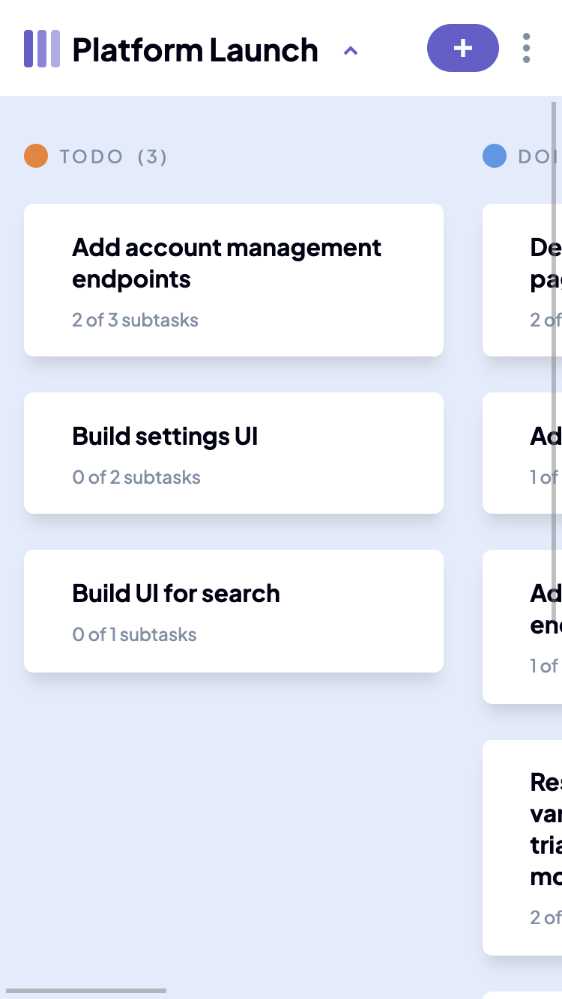
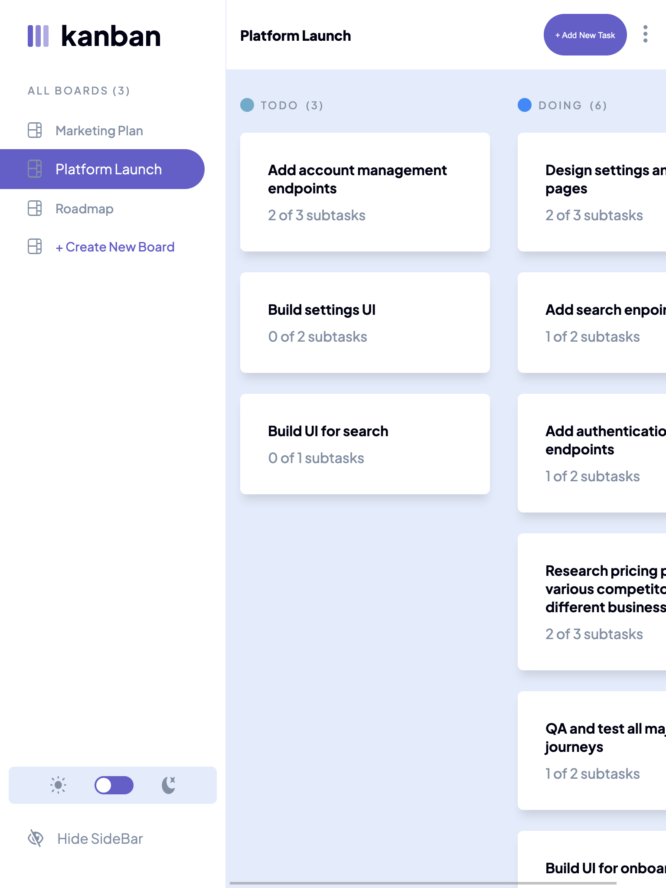
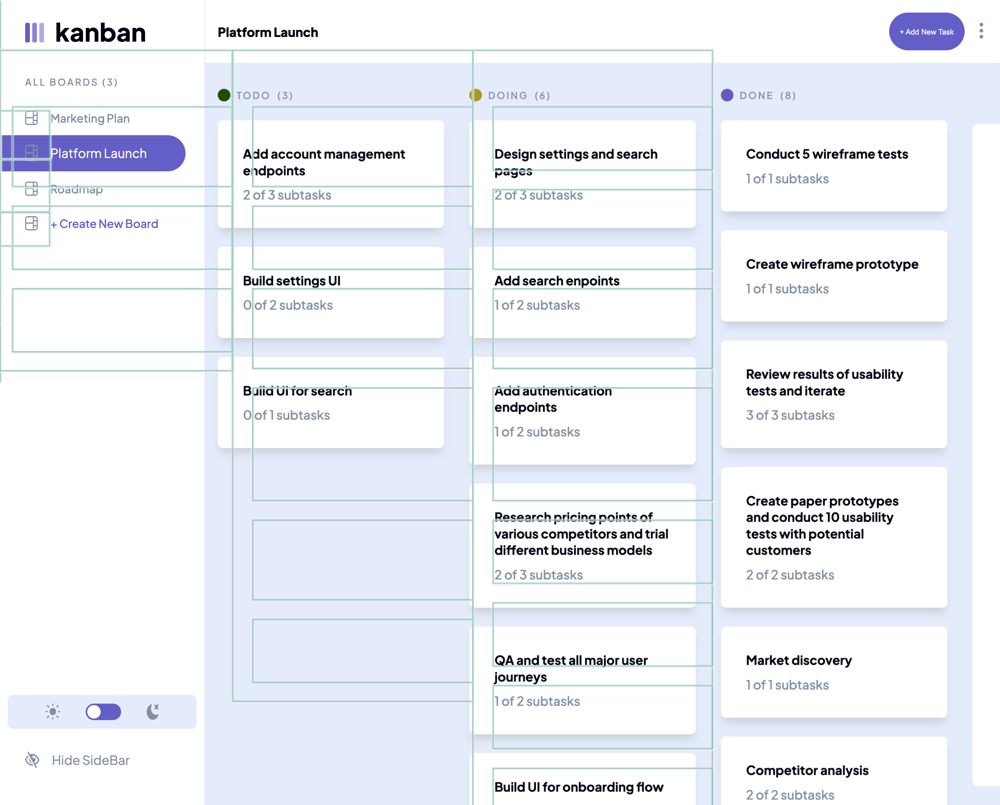

# Frontend Mentor - Kanban task management web app solution

This is a solution to the [Kanban task management web app challenge on Frontend Mentor](https://www.frontendmentor.io/challenges/kanban-task-management-web-app-wgQLt-HlbB). Frontend Mentor challenges help you improve your coding skills by building realistic projects. 

## Table of contents

- [Overview](#overview)
  - [The challenge](#the-challenge)
  - [Screenshot](#screenshot)
  - [Links](#links)
- [My process](#my-process)
  - [Built with](#built-with)
  - [What I learned](#what-i-learned)
- [Author](#author)

## Overview

### The challenge

Users should be able to:

- View the optimal layout for the app depending on their device's screen size
- See hover states for all interactive elements on the page
- Create, read, update, and delete boards and tasks
- Receive form validations when trying to create/edit boards and tasks
- Mark subtasks as complete and move tasks between columns
- Hide/show the board sidebar
- Toggle the theme between light/dark modes
- **Bonus**: Allow users to drag and drop tasks to change their status and re-order them in a column
- **Bonus**: Keep track of any changes, even after refreshing the browser (`localStorage` could be used for this if you're not building out a full-stack app)
- **Bonus**: Build this project as a full-stack application

### Screenshot






### Links

- Solution URL: [Solution](https://github.com/andyjv1/kanban-task-management-web-app)
- Live Site URL: [Live](https://your-live-site-url.com)

## My process

### Built with

- Semantic HTML5 markup
- CSS custom properties
- Flexbox
- CSS Grid
- Mobile-first workflow
- [React](https://reactjs.org/) - JS library
- [Next.js](https://nextjs.org/) - React framework
- [Styled Components](https://styled-components.com/) - For styles


### What I learned

How to use index to modify a value in an array

```js
  // Sets subtask name to the current input
  const onSubtaskNameChanged = (index, event) => {
    let data = []
    subtask.forEach((sub, i) => {
      data[i] = { ...sub }
    })
    data[index][event.target.title] = event.target.value
    setSubtask(data)
  }
  // Deletes subtask chosen
  const onDeleteSubtaskClicked = async (index, event) => {
    event.preventDefault()
    if (subtask[index].id) {
      let data = []
      subtask.forEach((sub, i) => {
        data[i] = { ...sub }
      })
      data.splice(index, 1)
      setSubtask(data)

      let deletesub = []
      deletesub.push(subtask[index])
      setDeleteSubtasks(deletesub)
    } else {
      let data = []
      subtask.forEach((sub, i) => {
        data[i] = { ...sub }
      })
      data.splice(index, 1)
      setSubtask(data)
    }
  }
```

## Author

- Frontend Mentor - [@andyjv1](https://www.frontendmentor.io/profile/andyjv1)
